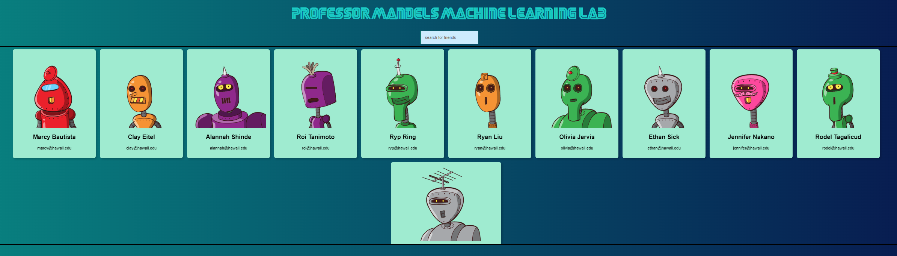
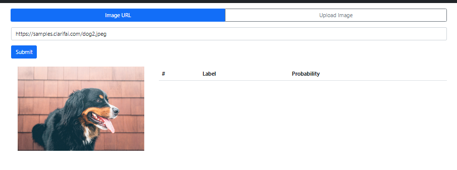
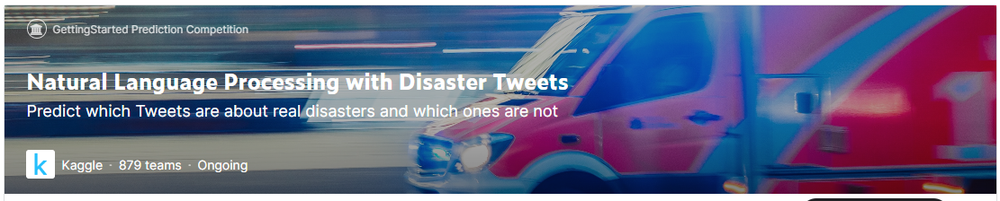
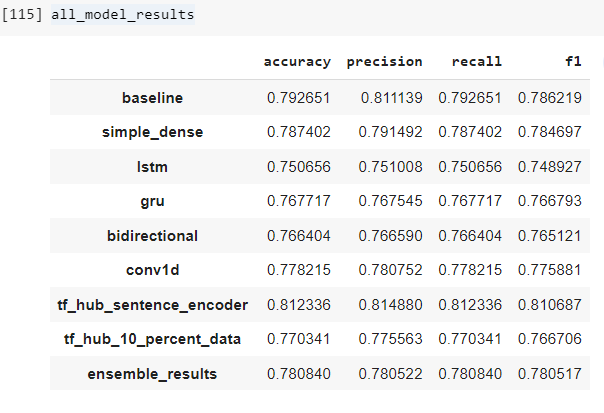
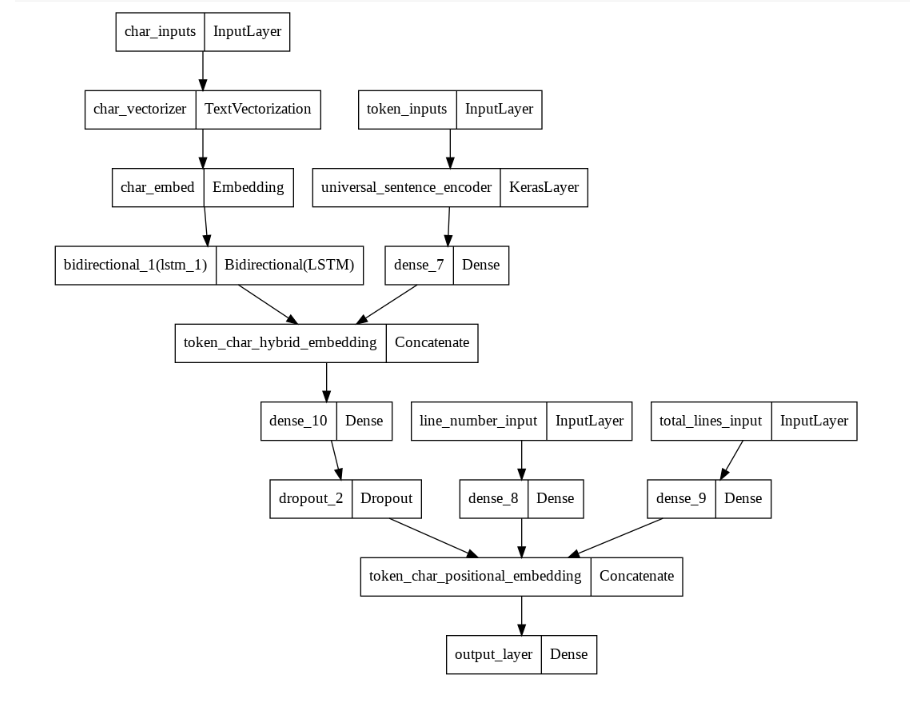
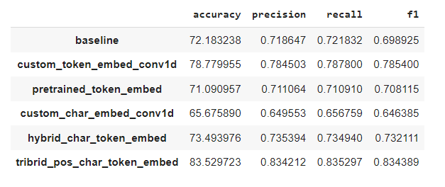

# **Rick Kobayashi**
**_"Welcome to my Data Science Portfolio. I am a compassionate Data Scientist. I help people do good work."_**

## Current Data Science Projects: An adventure in patience and understanding

### [Project 1: Machine Learning Lab](https://github.com/rickkobayashiphd/mandel)

"A not-so-serious tool to find Machine Learning Lab friends"

* Showcased a tool that uses an API to create images from text
* Thank you to RoboHash for this free resource https://robohash.org/

---
### Project 2: Image Detection Powered By AI(work in progress)

"Using the Clarifai deep learning AI platform"

* Showcased a tool that uses the Clarifai deep learning AI platform and its API to predict with some probability the contents of the .jpg image
* Thank you to Clarifai for this free resource https://www.clarifai.com/

---
### [Project 3: Google CoLab project using Kaggle's Natural Language Processing Dataset(work in progress)](https://github.com/rickkobayashiphd/nlp)

* Predicted with some measure of probability which tweets are disasters and which tweets are not disasters
* Thank you to Kaggle for this free dataset https://www.kaggle.com/competitions/nlp-getting-started/data

---
### [Project 4: Google Colab project to test models on PubMed Abstract datasets(work in progress)](https://github.com/rickkobayashiphd/pubmed)

* Attempted to model the Franck Dernoncourt and Ji Young Lee 2017 research paper, "PubMed 200k RCT: a Dataset for Sequential Sentence Classification in Medical Abstracts." 
* Compared the success of multiple models against a baseline in their ability to categorize and assign a heading to the sentences contained in PubMed abstracts.
 Thank you to Franck Dernoncourt for providing access to this dataset https://github.com/Franck-Dernoncourt/pubmed-rct

---

## **About**

I am your hard-working PhD, curious problem solver, and aspiring Data Scientist. 
I seek to understand your needs in order to help you do good work. 
I serve with integrity, compassion, and with actionable data-driven guidance.

* 12 years experience in the hospitality and family restaurant business at Cafe 100:
https://cafe100.com/

* 2 years experience as the CNC, Laser Engraver, CAD/CAM Operator and Carpenter for RK Builders (License BC-7556): 
https://www.rkwoodshawaii.com/

* 2 years experience with a start-up as the co-founder of TigerLuv Guitars:
https://tigerluv.com/

* 2 years experience as an electrician apprentice for Light Workers Electric (License C-32190)

---

## **Contact**

LinkedIn: https://www.linkedin.com/in/richardkobayashi/

GitHub: https://github.com/rickkobayashiphd
